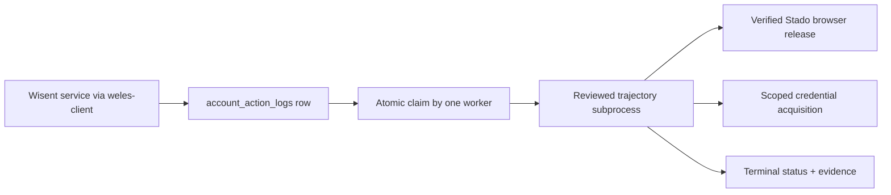

# Weles

Weles gives an authorized Wisent service one reviewed browser workflow executed on a controlled browser identity, with a terminal result and retained evidence — it is a private operated executor and never decides that a target permits automation.

[Deployment runbook](scripts/worker/deploy/README.md) · [Capture inventory](scripts/worker/deploy/FINGERPRINT_CAPTURE.md) · [Public client](https://github.com/wisent-ai/weles-client)

**Why trust this claim:** the worker refuses to start unless the database schema ledger reports a version inside `WELES_DATABASE_SCHEMA_MINIMUM..MAXIMUM` (`src/worker/schema_compatibility.ts`), and it refuses to launch a browser that is not a checksum-verified Stado release (`src/session/find_browser.ts`, `src/session/wsession.ts:346`). Both are startup failures, not warnings.

## Problem and intended users

An approved automation workflow needs a long-lived browser process, a stable execution identity, credentials that never reach a prompt or a log, a trajectory reviewed for the specific target, and evidence that the run did what it claims. Ad-hoc Playwright scripts mix those concerns: they carry credentials in argv, leave no audit trail, and make it impossible to tell an execution failure from a missing authorization.

| Intended user | Current problem | Successful outcome |
|---|---|---|
| Wisent service submitting work | No safe way to request a browser action without holding browser credentials and target configuration | Submits through `@wisent-ai/weles-client`; receives a terminal result and a verifiable receipt |
| Weles runtime operator | Scheduled browser work fails silently, wedges, or repeats an ambiguous external effect | Scheduler owns claims and terminal states; leases and watchdogs bound replay |
| Runtime engineer | Browser identity behaviour drifts between builds with no record of what was captured | Every run records the channels listed in the canonical capture inventory |

## Product boundaries

### Included

- a TypeScript worker that atomically claims rows from `account_action_logs` over PostgREST (`src/worker/claim.ts`);
- one supervised trajectory subprocess per claimed row (`src/worker/poll.ts`, 480 trajectories under `scripts/trajectories/`);
- Chromium and Firefox runtimes resolved only from checksum-verified Stado releases;
- engine-level browser-identity configuration applied at the browser boundary, not by page scripts alone;
- credential acquisition scoped per consumer and item through Skarbiec;
- recordings, traces, fingerprint capture and structured outcome evidence where the trajectory requests them;
- bounded retries, lease expiry, wedge watchdog and startup orphan reclaim (`src/worker/stale.ts`);
- a `weles` CLI and a `weles-mcp` JSON-RPC surface.

### Not included

- Weles does not decide whether a target permits automation.
- Possession of a credential is not authorization for an arbitrary origin or action.
- It does not expose browser patches, proxy rotation, stealth configuration, private trajectories, customer recordings or operational credentials as a public SDK.
- It is not the public receipt-verification boundary; that is `weles-client`.
- It provides no billing, account ownership or organization approval.
- It must not be used for evasion, fake engagement, unauthorized access, or bypassing a target's rules.

### Supported environments

| Surface | Supported | Not supported or unverified |
|---|---|---|
| Operating systems | `darwin-arm64`, `darwin-amd64`, `linux-amd64` (`src/session/find_browser.ts`) | Every other platform; the release resolver returns nothing for them |
| Runtime | Node.js with the TypeScript build in `dist/` | Running `src/` directly |
| Browsers | `weles-chromium` and `weles-firefox` Stado releases pinned by version and SHA-256 | Stock Chromium or Firefox; explicit path overrides are rejected |
| Deployment model | Operator-managed host under systemd or launchd | Hosted self-service executor; none is published |

### Operator responsibilities

The operator owns the host, the Skarbiec items behind every credential, the trajectory allowlist (`WELES_ACTION_ALLOWLIST`), the placement policy that decides which host may claim which action, proxy and browser-host cost, recording storage and retention, and the decision that a given target and action are authorized. Weles owns claim atomicity, terminal classification, browser-release verification, credential scoping at acquisition time, evidence capture, and refusing to run outside its declared schema range.

## Core use cases

| Actor | Starting situation | Product action | Successful result | Safety or cost boundary |
|---|---|---|---|---|
| Authorized Wisent service | An allowlisted action, an exact origin, credential references and an idempotency key are present | One worker claims the row and runs the reviewed trajectory | Terminal status on the row plus evidence metadata and a signed receipt | No trajectory is synthesized from the request; an unapproved action is skipped, not improvised |
| Runtime operator | A claimed row is wedged, its lease expired, or the worker restarted mid-run | Watchdog and startup reclaim classify the row and fail it closed | The row reaches a terminal state with the reason recorded | An ambiguous external effect is never silently retried |
| Runtime engineer | A new browser release must be qualified before deployment | A capture run records every channel in the inventory | A reviewable `recordings/<label>/<label>.inst.json` and a per-field diff | Capture describes the run; it proves neither authorization nor indistinguishability |

## How it works



- **Durable state:** the `account_action_logs` table in the Echo Supabase project is canonical for claims, status and outcome. Recordings and capture artifacts live on the worker host under the configured recordings root.
- **Credential boundary:** workloads submit references. Plaintext is acquired at run time from Skarbiec for one consumer/item/field tuple and must never enter task JSON, prompts, argv or logs. The launcher unsets inherited secret variables before exec.
- **Network boundary:** the worker initiates every connection — PostgREST for the queue, Skarbiec for credentials, Brama for model calls (`STADO_MODEL_ROUTER_URL`), the Stado release API for browsers, the artifact delivery host for evidence. Nothing dials in.
- **Failure boundary:** an unreadable schema ledger, a schema version outside the configured range, a missing browser receipt, or missing required configuration are startup failures. In flight, lease expiry and the wedge watchdog fail a row closed rather than retrying an effect that may already have landed.

## Quick start

This path builds the package and verifies the local toolchain. It requires no credentials and touches no target. It is not a deployment.

### Prerequisites

- Node.js and npm on `darwin-arm64`, `darwin-amd64` or `linux-amd64`
- Repository access; no production credential

### Install

```sh
npm install
npm run build
```

### Run the smallest realistic workflow

```sh
node dist/cli.js doctor
```

### Expected result

```text
{
  "ok": true,
  "version": "0.5.0",
  "node": "v22.14.0",
  "bin": {
    "weles": "dist/cli.js",
    "weles-mcp": "dist/mcp.js"
  },
  "env": {
    "CHROMIUM_PATH": "unset",
    "WELES_USE_STOCK_CHROMIUM": "unset"
  }
}
```

`version` is the package version, `node` is the host runtime, and both `env` entries are expected to read `unset`: explicit browser-path overrides are rejected by `src/session/wsession.ts`.

Running an actual workflow is a separate, credentialed activity: provision the environment, browser releases, Skarbiec items, trajectory allowlist and service supervision described in [`scripts/worker/deploy/README.md`](scripts/worker/deploy/README.md), then start the worker with `node scripts/worker/run.mjs`. A product-level first success is an approved client submission that reaches one terminal result whose receipt and evidence digest verify against the configured public key.

## Primary interfaces

| Interface | Canonical purpose | Stability | Reference |
|---|---|---|---|
| Worker process `node scripts/worker/run.mjs` | Claim and execute scheduled actions | Internal, operator-managed | [Deployment runbook](scripts/worker/deploy/README.md) |
| CLI `weles` | `doctor`, `open`, `screenshot`, `onboarding`, `mcp` | Internal | `src/cli.ts` |
| MCP `weles-mcp` | JSON-RPC browser surface where deployment policy enables it | Internal | `src/mcp.ts` |
| `@wisent-ai/weles-client` | Safe submission, cancellation and receipt verification | Public contract | [weles-client](https://github.com/wisent-ai/weles-client) |

### Documentation by intent

- **Deploy and operate:** [`scripts/worker/deploy/README.md`](scripts/worker/deploy/README.md)
- **Understand browser identity capture:** [`scripts/worker/deploy/FINGERPRINT_CAPTURE.md`](scripts/worker/deploy/FINGERPRINT_CAPTURE.md) — 76 collector surfaces in 13 sections, each flagged wired, partial or todo
- **Rebuild the patched Firefox:** [`scripts/firefox/PATCHING.md`](scripts/firefox/PATCHING.md)
- **Integrate as a caller:** [`weles-client`](https://github.com/wisent-ai/weles-client)

## Operational model

| Concern | Contract |
|---|---|
| Configuration | Deployment-owned environment sourced by `scripts/worker/deploy/launch.sh`, which refuses to start unless the database, router, object, artifact, operator-CDP, allowlist, diagnostics and release variables are all present. No repository default authorizes a live target. |
| State | `account_action_logs` in the Echo Supabase project is canonical for claims and outcomes; recordings and capture artifacts follow the configured evidence policy on the worker host. |
| Credentials | Acquired per consumer/item/field from Skarbiec at run time. The launcher unsets `SUPABASE_*`, browser paths, GitHub and provider variables before exec so nothing leaks through the environment. Plaintext never enters task JSON, prompts or logs. |
| Networking | Worker-initiated only: PostgREST, Skarbiec, Brama (`STADO_MODEL_ROUTER_URL`, model alias `weles/agent/primary`), the Stado release API, artifact delivery. |
| Cost | Browser hosts, proxies, solver vendors, storage and model calls are operated costs charged to the deployment. No pricing or hosted entitlement is published here. |
| Observability | Structured task state on the row, process diagnostics, evidence metadata and the fingerprint capture inventory. These distinguish execution failure from missing authorization or unavailable infrastructure. |
| Upgrades | Worker bundles ship as `worker-vX.Y.Z` GitHub Releases built by `.github/workflows/release-worker.yml` with embedded provenance and a checksum sidecar. Browser releases are pinned separately by version and SHA-256. |
| Recovery | Leases, the wedge watchdog and startup orphan reclaim bound replay. An ambiguous external effect must be resolved by the operator before resubmission. |

### Database schema ownership

The schema is owned by [`wisent-ai/wisent-supabase-echo`](https://github.com/wisent-ai/wisent-supabase-echo), the only source of truth for the Supabase project `yqizdfkfnmhddfemdxtq`. Every DDL change — tables, columns, indexes, policies, functions and the `weles_schema_migrations` ledger row recording it — is proposed as a pull request there and applied only by its CI on `main`. This repository holds no migrations, no `supabase/config.toml` and no linked-project state; `supabase/` is gitignored so a local `supabase` link cannot reintroduce them. Nobody runs the `supabase` CLI against production from a workstation; the pre-commit hook refuses to commit such invocations.

What this repository declares is the schema version it requires. At startup `src/worker/schema_compatibility.ts` reads the highest `version` from `weles_schema_migrations` and refuses to run unless it falls inside `WELES_DATABASE_SCHEMA_MINIMUM` (default `4`) through `WELES_DATABASE_SCHEMA_MAXIMUM` (default `5`). Widening that range is a code change here; producing the version it points at is a change in `wisent-supabase-echo`.

## Project status and support

| Property | Current contract |
|---|---|
| Maturity | Private operated executor |
| Latest supported release | Package version `0.5.0`; worker bundles on the `worker-v*` release channel |
| Compatibility | Database schema versions `4..5` by default; browser releases pinned per deployment |
| Distribution | No public executor package. Public integration is `@wisent-ai/weles-client`; source availability of that client does not imply availability of this service. |
| License | [MIT](LICENSE). Distribution and browser-patch obligations require separate review before any executor release. |

- **Reproducible defects:** repository issue tracker, with the action name, row id and worker instance id.
- **Security reports:** the repository's private GitHub Security Advisory channel. Never place credentials, trajectories, recordings or target details in a public issue.
- **Releases:** `worker-v*` GitHub Releases in this repository.

### History note

The `weles` repository briefly hosted a parallel Python implementation alongside this TypeScript one. The Python tree was deleted after every consumer was ported or accepted as breakage; the TypeScript rewrite has been the production path since early April 2026. A script elsewhere doing `from weles import AsyncWeles` is broken until it is rewritten.
