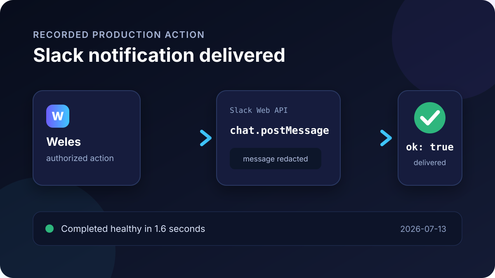
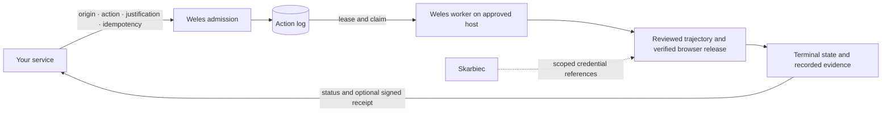

<!-- wisent-banner:start -->
<p align="center">
  
</p>
<!-- wisent-banner:end -->

<!-- wisent-readme-signals:start -->
[](https://github.com/wisent-ai/weles) [](https://github.com/wisent-ai/weles/issues) [](https://wisent.com) [](https://discord.gg/qRjpkthq54) [](https://www.linkedin.com/company/wisent-ai/) [](https://x.com/wisentai) [](https://calendly.com/lbartoszcze)
<!-- wisent-readme-signals:end -->

# Weles: Undetectable Browser for Perfect AI Agent Internet Use

Your AI agents deserve to explore the entire internet. AI can now write
software, reason for hours, and order your groceries, but it still fails or
takes ages when you ask it to open a website and log in to your account.

Weles is the solution. We turn the open internet into an API.

Weles is an undetectable browser that combines custom C++-patched Chromium and
Firefox forks with rotating fingerprints to stop your AI from running into
CAPTCHAs and bans. Every time you crawl a website, it gets mapped into a
trajectory, allowing future runs to use the cached traversal instead of having
to rediscover how the website works. When a run fails, Weles records videos
showing the points of failure to give you a clear understanding of what happened
and how it can be fixed.

Give your AI the keys to the internet. The browser-use experience your AI deserves.

[Documentation](https://weles.wisent.com/docs) · [Releases](https://github.com/wisent-ai/weles/releases) · [MIT licence](LICENSE)

## See Weles work

These are public, redacted cuts from production runs. Dark boxes cover credentials
and account identifiers; the browser interaction is otherwise unchanged.

Weles opens GitHub and reaches the authenticated dashboard:


The Reddit cut ends at the enabled Log In button; the production action completed
healthy and a later health action confirmed the stored session remained usable:


Weles reaches LinkedIn's authenticated home feed; the public cut hides the profile:


Slack delivery uses `chat.postMessage`, not a browser, so there is no screen
recording. The production action received `ok: true` and completed in 1.6 seconds:



## Request access

Weles is an operated service. Access starts through
[weles.wisent.com/docs](https://weles.wisent.com/docs#get-access) or by
[booking a call](https://calendly.com/lbartoszcze). An approved deployment
provides its endpoint, organization identifier, and organization-scoped token:

```sh
export WELES_API_BASE=<deployment-endpoint>
export WISENT_ORGANIZATION_ID=<organization-uuid>
export WELES_TOKEN=<organization-scoped-token>
```

Both Weles and [weles-client](https://github.com/wisent-ai/weles-client) are public,
MIT-licensed source. You can inspect, build, and operate your own deployment.
A checkout does not include a hosted endpoint, approved trajectories, managed
credentials, evidence retention, or an SLA; these are provisioned per organization.

## Import existing Weles workflows

First setup can adopt the JSON returned by `GET /api/v1/trajectories`:

```sh
weles onboarding next
weles onboarding import <trajectory-export.json> --host <managed-worker-hostname>
```

The reusable command outside onboarding is:

```sh
weles import <trajectory-export.json> --host <managed-worker-hostname>
```

Both call `POST /api/v1/imports` using `WELES_API_BASE`, `WISENT_ORGANIZATION_ID`,
and `WELES_TOKEN`. Import validates the entire export before writing, requires
its tenant to match the authenticated organization, preserves existing rows,
and reports `imported`, `unchanged`, or `refused` for each source trajectory.
Accepted definitions are stored as drafts with their source identity, digest,
and exact target hostname. A draft is not authorization to execute.

The local HTTP service exposes authenticated `POST /imports` around that same
operation. It always requires `WELES_API_TOKEN`; the destination uses `WELES_TOKEN`.
Imports accept browser, OS, locale, headless, proxy, and session-label configuration,
but never scan or copy profiles, cookies, or credentials. A session label refers
only to state already present on the selected host.

Agents submit authorized workflows through
[`@wisent-ai/weles-client`](https://weles.wisent.com/docs/client), naming the exact
origin, action, non-secret input, credential references, justification, and
idempotency key. An accepted production action resolves to a reviewed trajectory
and ends in an explicit action-log state. When receipt issuance is configured,
the client verifies the signed outcome and evidence digest offline.

## Enterprise

Weles Enterprise makes browser work a reviewed production capability. An
engagement defines origins and actions, versions approved trajectories, provisions
client and worker access, and binds credentials and evidence to the organization.
It can include deployment-ring policy, credential lifecycle integration, evidence
retention, and operating support. It grants no blanket permission to automate a
website; the source remains public. [Book a call](https://calendly.com/lbartoszcze).

## What your agents can do

- Browse through custom Chromium and Firefox builds with rotating fingerprints.
- Replay approved trajectories instead of rediscovering every workflow.
- Diagnose failures from the recorded operation, browser state and evidence.
- Verify terminal outcomes and, when configured, signed execution receipts.
- Use the Skarbiec credential lifecycle: acquire, adopt, rotate, reset, verify.
- Bound submissions by exact origins, actions, justification and idempotency.

## How it works



Credentials resolve through scoped Skarbiec grants, not plaintext requests. Draft
discovery can map a journey but cannot authorize production execution. Target
authorization remains with you: technical success does not establish permission.

### Declared engagement and observation

Interactions use `generic_saved_task` and the reviewed engagement declaration:

```json
{ "action": "generic_saved_task",
  "input": { "engagement": "twitter.like", "target_url": "https://x.com/wisent_ai/status/1" } }
```

Reading uses `generic_keeper_task` and the reviewed observation declaration:

```json
{ "action": "generic_keeper_task",
  "input": { "observation": "reddit.search", "query": "representation engineering" } }
```

`src/worker/deploy/weles-engagement-declaration.json` and
`src/worker/deploy/weles-observation-declaration.json` own the reviewed trajectories,
origins, and observation budgets. Admission refuses undeclared names, absent
trajectories, and conflicting caller-supplied origins or budgets. New sites extend
these declarations rather than adding verbs. The
[command-surface reference](https://weles.wisent.com/docs/command-surface) owns the
removed per-site verbs, replacements, counts, and recorded source revisions.

```sh
node docs/examples/resolve-action.mjs generic_saved_task twitter.like
node docs/examples/resolve-action.mjs generic_keeper_task reddit.search
```

## Wisent integrations

**Brama.** Skarbiec owns subscription identities and login material. Weles has no
separate account catalogue. Brama resolves an exact subscription through
authenticated `POST /reauth/resolve`, supplying `provider` and `subscription_id`.
It then calls `POST /reauth` with the returned `account_revision`. Weles follows
existing Skarbiec source references, performs OAuth on its Stado-selected browser
host, and stores the grant on the same subscription. It never imports provider
CLI sessions. Brama confirms repair only after its own credential refresh succeeds.

Results identify the subscription, login item, actual failed operation, HTTP status
and run id. `account_revision` describes Skarbiec data; `source_revision` identifies
the Weles software. Missing source references, cycles, conflicting login material
and changed identity are refused before credential persistence.
Google sign-in selects a visible password choice before opening alternative
methods. Hidden refusal templates do not count as provider refusals. A visible
refusal or unavailable password challenge reports its observed page and stage;
the same run never resubmits the selected challenge. Session closure also stops
its measurement timers, so retained results do not wait for the worker timeout.

Both services acquire `brama-weles-reauth/token` from Skarbiec with their own
workload identities. Weles accepts that bearer only on the reauthentication routes.
No shared environment file or copied token connects them. They resolve the canonical
Skarbiec endpoint through Stado and use its attested active executable for local
capability brokering, never an alternate vault. Brama resolves `weles-admission`
as consumer `brama` with `credential-lifecycle`; `BRAMA_WELES_URL` remains an
explicit endpoint override.

Reauthentication evidence survives releases under `$HOME/.stado/var/weles/recordings`;
run verdicts live under `$HOME/.stado/weles-detached-runs`. Authenticated
`GET /diagnostics/<run_id>` includes `run-result.json` for accepted runs, including
pre-browser failures, and lists retained DOM, video and trajectory logs when present.
A completed diagnostic journey is not proof that the website operation succeeded;
read the recorded result and final state.

**Skarbiec.** Exact `consumer|item|field` scopes supply credentials for approved
operations. Identity resolution reads the same canonical items used by execution.

**Stado.** Stado places and operates the approved host and verifies browser release
coordinates. Synchronous reauthentication uses the same trajectory as queued work.
The Weles package includes its recording executable rather than relying on an
evictable host cache. `weles doctor` reports the expected recording component and
whether it is present; successful browser execution proves that it actually works.

### Mobile egress managed by Stado

Weles may use a phone's mobile connection as its browser exit. Stado owns the
long-running proxy; Weles owns proxy selection, target policy and browser execution.
USB tethering is preferable to Wi-Fi tethering for stability. Use the approved
host's real interface and installed Stado executable:

```sh
networksetup -listallhardwareports
stado egress mobile serve --interface en7 --port 8781
weles open https://example.com --proxy http://127.0.0.1:8781
stado service ensure weles-mobile-egress \
  --host <weles-host> --from /Users/<service-account>/.stado/bin/stado \
  --arg egress --arg mobile --arg serve --arg=--interface --arg en7 \
  --arg=--port --arg 8781 --reason "Weles mobile egress"
stado service status weles-mobile-egress
```

`en7` is an example, not a default. The proxy binds upstream connections to that
interface and refuses non-loopback listeners or an unusable IPv4 interface. Browser
and proxy run on the same host. Trajectories pass `proxy: 'http://127.0.0.1:8781'`
to `WSession.start`; the CLI uses `--proxy`. Normal Stado commands own later
status, logs and service lifecycle.

Mobile exits may match a site's expected identity but can be slower, unstable or
behind carrier NAT. Residential and datacenter exits fit different workloads;
the type alone proves no quality. Check IP, ASN, geography, proxy classification,
DNS/WebRTC behavior, latency and target response. Stado's real-device egress tests
require a trusted phone and observed mobile IP classification. Disconnected hardware
or an unclassified exit is not a passing result.

## Compatibility and status

- Client source defines the `0.1.0` minimum public contract; an endpoint and immutable
  package release are separate provisions, not promises from a checkout.
- Task, cancellation, status and receipt schemas expose versioned `current` aliases.
- Workers ship as immutable releases promoted through the declared deployment rings.
- Chromium and Firefox launch only with the Stado-selected release coordinate and checksum.

## Community and support

Use [Discord](https://discord.gg/qRjpkthq54) for discussion and the repository issue
tracker for operational defects. Include the action-log id, worker identity and
release coordinate, not credentials or private recordings.

## Security and licence

Report vulnerabilities through a
[private GitHub Security Advisory](https://github.com/wisent-ai/weles/security/advisories/new).
Never put credentials, private trajectories, recordings or target details in public issues.
[MIT](LICENSE). Source availability grants neither operated-service access nor target authorization.
