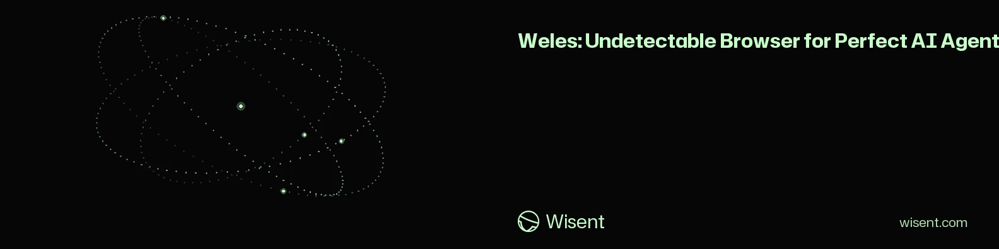
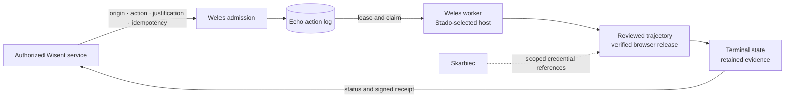

<!-- wisent-banner:start -->
<p align="center">
  
</p>
<!-- wisent-banner:end -->

[](https://weles.wisent.com)
[](https://github.com/wisent-ai/weles/releases/latest)
[](https://github.com/wisent-ai/weles/releases)
[](https://github.com/wisent-ai/weles/actions/workflows/build-check.yml?query=branch%3Amain)
[](LICENSE)
[](https://discord.gg/qRjpkthq54)
[](https://www.linkedin.com/company/wisentai/)
[](https://x.com/wisentai)
[](https://calendly.com/lbartoszcze)

# Weles

Browser Use Harness. Your AI Agents Can Now Use Internet. Cutting Token Use by 99% by caching trajectories. A harness to stimulate bypassing captchas and accessing all parts of the internet without any problems.

[Public client](https://github.com/wisent-ai/weles-client) · [Operator runbook](scripts/worker/deploy/README.md) · [Capture inventory](scripts/worker/deploy/FINGERPRINT_CAPTURE.md) · [Worker releases](https://github.com/wisent-ai/weles/releases)

> **Why this boundary is enforced, not promised:** before claiming work, the worker requires a valid placement policy, queue access, worker enablement and writable diagnostic sinks ([`src/worker/poll.ts`](src/worker/poll.ts)). Browser launch accepts only an executable whose local receipt matches the exact Stado release coordinate and checksum ([`src/session/find_browser.ts`](src/session/find_browser.ts)).

## Why Weles exists

Some approved operations still require a real browser session: an authenticated administrative surface has no suitable API, the target binds state to a browser identity, or the result needs visual and network evidence. A one-off browser script can perform the click sequence, but it usually combines authorization, credentials, host choice, browser provenance, retries and evidence in one unreviewed process.

Weles separates those concerns. The caller submits an exact origin and action through the public client; a Stado-placed worker leases the task; a checked-in trajectory runs with a verified browser release; and the result closes with evidence that can be tied back to the request.

Weles is for:

- **Wisent service owners** submitting a separately authorized browser-only operation;
- **trajectory authors and reviewers** maintaining the finite action catalog;
- **runtime operators** promoting exact worker and browser artifacts through controlled rings.

It is not a public browser-automation service, an authorization oracle, or a way to run arbitrary Playwright code on demand.

## How one workflow runs



1. The public [`@wisent-ai/weles-client`](https://github.com/wisent-ai/weles-client) binds the organization, origin, allowlisted action, credential references, evidence policy, justification and idempotency key.
2. Admission records the request in the Echo-owned action log. The database lease permits claims only from the active production generation.
3. The worker refuses to claim when placement policy, schema compatibility, queue access or evidence persistence is unavailable.
4. The action name resolves to one checked-in trajectory. Login material is resolved through exact Skarbiec item, consumer and field grants rather than plaintext service-login columns.
5. The worker records a terminal status, imports trajectory evidence and costs when present, and exposes the result through the client contract. Onboarding completes only after the client verifies a signed receipt and its bound evidence digest.

## Enforced boundaries

| Boundary | What Weles enforces | Failure behavior |
| --- | --- | --- |
| Admission | Exact organization, origin, action, credential references, justification and idempotency | Reject before queueing |
| Placement | Stado policy selects whether this worker may claim and where it may run | Stay idle or return an infrastructure error |
| Action catalog | An action must resolve to a checked-in trajectory | Close the task as failed; never improvise a workflow |
| Credentials | Service secrets resolve through scoped Skarbiec contracts | Refuse before opening the protected surface |
| Browser provenance | Chromium or Firefox must match the configured immutable release receipt | Refuse browser launch |
| Evidence | Forensic object storage and direct capture persistence must both be writable | Leave the queued task for a healthy worker |
| Terminal state | Completion, failure, cancellation and pending review are explicit action-log states | Preserve the original failure even when diagnostic instrumentation is retried |

Authorization remains outside Weles. A target-specific trajectory and a technically successful run do not establish that a target permits automation.

## Start at the right interface

| Reader | Start here | Successful result |
| --- | --- | --- |
| Service integrator | [`weles-client`](https://github.com/wisent-ai/weles-client) | Submit, cancel and inspect an authorized task; verify its signed receipt |
| Runtime operator | [Worker deployment runbook](scripts/worker/deploy/README.md) | Install immutable artifacts, promote one manifest and observe its ring/host state |
| Trajectory reviewer | [`src/platforms/`](src/platforms) and [`scripts/trajectories/`](scripts/trajectories) | Trace an action name to the reviewed browser workflow it executes |
| Incident investigator | [Capture inventory](scripts/worker/deploy/FINGERPRINT_CAPTURE.md) | Identify which run artifact answers a browser, network or host question |
| Contributor | Local package inspection below | Build the package and confirm the CLI surface without starting a worker |

### Inspect a source checkout

Prerequisites: Node.js 22, npm and a checkout of this private repository.

```bash
npm ci
npm run build
node dist/cli.js doctor
```

The final command prints JSON containing `"ok": true`, the source package version, the Node runtime and the installed `weles` / `weles-mcp` binary paths. It does not launch a browser, claim a task or authorize a target.

There is intentionally no production `npm start` shortcut. Operators install immutable release artifacts and start the deployment-managed worker described in the [runbook](scripts/worker/deploy/README.md); launching `scripts/worker/run.mjs` from a mutable checkout is not the production path.

## Primary interfaces

| Interface | Purpose | Contract source |
| --- | --- | --- |
| `@wisent-ai/weles-client` | Task submission, cancellation, status and signed-receipt verification | [Public client repository](https://github.com/wisent-ai/weles-client) |
| `weles` | Local inspection, first-use receipt verification and contributor browser tooling | [`src/cli.ts`](src/cli.ts) |
| `weles-mcp` | MCP adapter for the local browser surface | [`src/mcp.ts`](src/mcp.ts) |
| Worker process | Lease, authorize, execute and close action-log rows | [`src/worker/poll.ts`](src/worker/poll.ts) |
| Release scripts | Assemble, attest, install, activate, inspect and roll back one manifest | [`scripts/release/`](scripts/release) |

The CLI and MCP commands are source surfaces, not a public entitlement to the operated executor. Production callers use the client contract; production workers use deployment-owned configuration.

## Release and compatibility

Worker releases are immutable `worker-v*` GitHub Releases with archives, SHA-256 sidecars and Sigstore bundles for `linux-x64`, `darwin-x64` and `darwin-arm64`. A release does not change a running worker by itself: one deployment manifest must advance through `candidate`, `development`, `canary` and `production`, with the same manifest digest at every ring.

| Concern | Current repository contract |
| --- | --- |
| API schemas | Versioned: `weles.task.v1`, `weles.cancellation.v1`, `weles.task-status.v1`, `weles.receipt.v1`, `weles.version.v1`; aliases: `weles.task.current`, `weles.cancellation.current`, `weles.receipt.current` |
| Minimum client | `0.1.0` |
| Database | Target schema `5`; worker compatibility range `4..5`; expand-contract migrations; no automatic down-migrations |
| Rollout | Ordered four-ring promotion; candidate bytes must equal promoted bytes; no partial component activation |
| Production pointer | The manifest-based pointer in [`release/current-production.json`](release/current-production.json) is currently `uninitialized` |
| Distribution | Private operated executor; public integration code lives in `weles-client` |

The compatibility source of truth is [`release/compatibility-policy.json`](release/compatibility-policy.json). Runtime state comes from `node scripts/release/status.mjs --ring <ring> --host <stado-host>`, not from the branch tip or package version.

## Repository map

| Path | Owns |
| --- | --- |
| [`src/api/`](src/api) | Admission and worker HTTP surfaces |
| [`src/worker/`](src/worker) | Queue claims, placement, execution and terminal-state writes |
| [`src/session/`](src/session) | Browser selection, lifecycle, capture and replay |
| [`src/platforms/`](src/platforms) | Platform-specific runtime modules |
| [`src/secrets/`](src/secrets) | Scoped secret acquisition and service contracts |
| [`scripts/trajectories/`](scripts/trajectories) | Reviewed executable workflows |
| [`scripts/worker/deploy/`](scripts/worker/deploy) | Host prerequisites, service launch and operational recovery |
| [`scripts/release/`](scripts/release) | Immutable manifest publication, promotion and rollback |
| [`release/`](release) | Machine-readable API, database and rollout compatibility |

Detailed operational procedures belong in the runbook; capture field definitions belong in the capture inventory. The root README stays focused on the product boundary and the shortest safe route for each reader.

## Support, security and license

- **Operational defects:** use this repository's issue tracker with the action-log row ID, worker instance ID and release coordinate. Do not attach recordings or credentials.
- **Sensitive reports:** use a [private GitHub Security Advisory](https://github.com/wisent-ai/weles/security/advisories/new). Never place credentials, trajectories, recordings or target details in a public issue.
- **Releases:** use the immutable [`worker-v*` channel](https://github.com/wisent-ai/weles/releases); do not deploy a branch tip.
- **License:** [MIT](LICENSE). Source availability does not grant access to the private operated service or authorize automation of any target.
