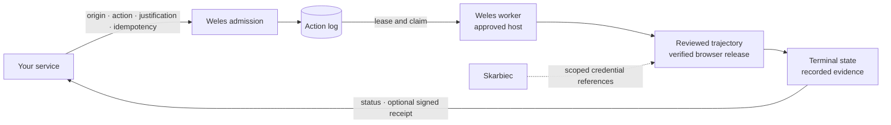

<!-- wisent-banner:start -->
<p align="center">
  
</p>
<!-- wisent-banner:end -->

<!-- wisent-readme-signals:start -->
[](https://github.com/wisent-ai/weles) [](https://github.com/wisent-ai/weles/issues) [](https://wisent.ai) [](https://discord.gg/qRjpkthq54) [](https://www.linkedin.com/company/wisent-ai/) [](https://x.com/wisentai) [](https://calendly.com/lbartoszcze)
<!-- wisent-readme-signals:end -->

[](https://weles.wisent.com) [](https://github.com/wisent-ai/weles/releases/latest) [](https://github.com/wisent-ai/weles/releases) [](https://github.com/wisent-ai/weles/actions/workflows/build-check.yml?query=branch%3Amain) [](LICENSE) [](https://discord.gg/qRjpkthq54) [](https://www.linkedin.com/company/wisentai/) [](https://x.com/wisentai) [](https://calendly.com/lbartoszcze)

# Weles: Undetectable Browser for Perfect AI Agent Internet Use

Your AI agents deserve to explore the entire internet. AI can now write
software, reason for hours, and order your groceries, but it still fails or
takes ages when you ask it to open a website and log in to your account.

Weles is the solution. We turn the open internet into an API.

Weles is an undetectable browser that combines custom C++-patched Chromium and
Firefox forks with rotating fingerprints to stop your AI from running into
CAPTCHAs and bans. Every time you crawl a website, it gets mapped into a
trajectory, allowing future runs to use the cached traversal instead of having
to rediscover how the website works. When a run fails, Weles records videos
showing the points of failure to give you a clear understanding of what happened
and how it can be fixed.

Give your AI the keys to the internet. The browser-use experience your AI
deserves.

## Evidence from every run

Weles keeps the execution evidence beside the action that produced it instead
of turning private account state into a public demo. A run can retain:

| Evidence | What it answers |
| --- | --- |
| Video | What the browser displayed and when the state changed |
| Final instrumented DOM dump | Which page state the trajectory actually reached |
| HAR and safe Chromium netlog | Which network requests succeeded or failed |
| Fingerprint manifest and browser receipt | Which browser identity and verified build ran |
| Action-log terminal state and signed receipt | Which request ran, its outcome, and the evidence digest |

For example, recorded action `3ed81927` on 2026-08-10 reached its terminal state
in 30.0 seconds and retained video, a safe network log, a final instrumented DOM
dump, and a fingerprint manifest. The artifacts stay private because they can
contain authenticated target state; the caller verifies the signed result
through `weles-client`.

## Request access

Weles is an operated service. Access starts with a conversation through
[weles.wisent.com](https://weles.wisent.com) or by
[booking a call](https://calendly.com/lbartoszcze). An approved deployment
provides its endpoint, organization identifier, and organization-scoped token:

```sh
export WELES_API_BASE=<deployment-endpoint>
export WISENT_ORGANIZATION_ID=<organization-uuid>
export WELES_TOKEN=<organization-scoped-token>
```

From there your agents submit authorized workflows through the public
[`@wisent-ai/weles-client`](https://github.com/wisent-ai/weles-client):

```js
import { WelesClient } from '@wisent-ai/weles-client';

const client = new WelesClient({
  endpoint: process.env.WELES_API_BASE,
  bearer: process.env.WELES_TOKEN,
  organizationId: process.env.WISENT_ORGANIZATION_ID,
  allowedOrigins: ['https://console.example.com'],
  allowedActions: ['export-approved-report'],
});

const accepted = await client.submit({
  origin: 'https://console.example.com',
  action: 'export-approved-report',
  input: { report: 'monthly' },
  credentialRefs: ['customer-console-account'],
  evidencePolicy: 'receipt',
  justification: 'Export authorized by the account owner.',
}, { idempotencyKey: 'caller-retained-operation-id' });
```

An accepted production action resolves to its reviewed trajectory and closes
with an explicit terminal state. When receipt issuance is configured, the
client verifies the signed outcome and evidence digest offline without reading
worker logs.

The client repository is public development source. A source checkout does not
promise a hosted endpoint, an approved trajectory, evidence retention, or an
SLA; those exist only when they are provisioned for an organization.

## Enterprise

Weles Enterprise is the operated path for teams that need browser work to be a
reviewed production capability rather than an unowned automation script. An
engagement defines the exact origins and actions, turns approved journeys into
versioned trajectories, provisions the client and worker boundary, and binds
credentials and retained evidence to the organization.

The scope can include trajectory design and review, deployment-ring policy,
credential lifecycle integration, evidence-retention policy, and operational
support for the agreed workflows. It does not grant blanket authorization to
automate a website, and it does not turn the private executor into a
self-hostable community edition.

[Book an enterprise implementation call](https://calendly.com/lbartoszcze).

## What your agents can do

- **Browse like a human.** Custom C++-patched Chromium and Firefox forks with
  rotating fingerprints keep your agents out of CAPTCHA loops and away from
  bans.
- **Cache every website as a trajectory.** The first run maps the journey;
  later approved runs replay the cached route instead of paying the discovery
  cost again.
- **Recover from failure fast.** Every failed run is recorded with the exact
  point of failure marked, so you see what happened and how to fix it.
- **Prove what happened.** Every run closes with a terminal action-log state;
  deployments with receipt issuance add a signed outcome and evidence digest
  that `weles-client` verifies offline.
- **Operate credentials safely.** API keys and passwords move through the
  Skarbiec lifecycle — acquire, adopt, rotate, reset, verify — without
  plaintext ever touching a prompt or a log.
- **Stay in bounds.** Exact origin and action allowlists, idempotency keys,
  and a required human-readable justification on every submission.

## How it works



Your service submits an exact origin and action; a worker on an approved host
claims the task; and the production action resolves to a checked-in trajectory
executed in a verified browser build. Credentials resolve through scoped
Skarbiec grants — never through plaintext in the request. Draft discovery can
map a new journey, but it does not authorize that journey as a production
action. Authorization for the target remains with you: a technically successful
run does not establish that the target permits automation.

## Compatibility and status

- **Client contract:** the public
  [`weles-client`](https://github.com/wisent-ai/weles-client) source currently
  defines the `0.1.0` minimum contract. It has no immutable package release or
  hosted-endpoint promise until an operator provisions them.
- **API:** versioned task, cancellation, status, and receipt schemas expose
  stable `current` aliases.
- **Executor:** the private operated worker ships as immutable `worker-v*`
  artifacts promoted through candidate, development, canary, and production
  rings.
- **Browsers:** Chromium and Firefox launch only when the local receipt matches
  the exact Stado release coordinate and checksum selected for the worker.

## Community and support

- **Discussion and integration help:** the [Wisent Discord](https://discord.gg/qRjpkthq54).
- **Operational defects:** this repository's issue tracker with the action-log
  row ID, worker instance ID, and release coordinate. Never attach recordings
  or credentials.

## Security

Report vulnerabilities through a
[private GitHub Security Advisory](https://github.com/wisent-ai/weles/security/advisories/new).
Never place credentials, trajectories, recordings, or target details in a
public issue.

## License

[MIT](LICENSE). Source availability does not grant access to the operated
service or authorize automation of any target.
