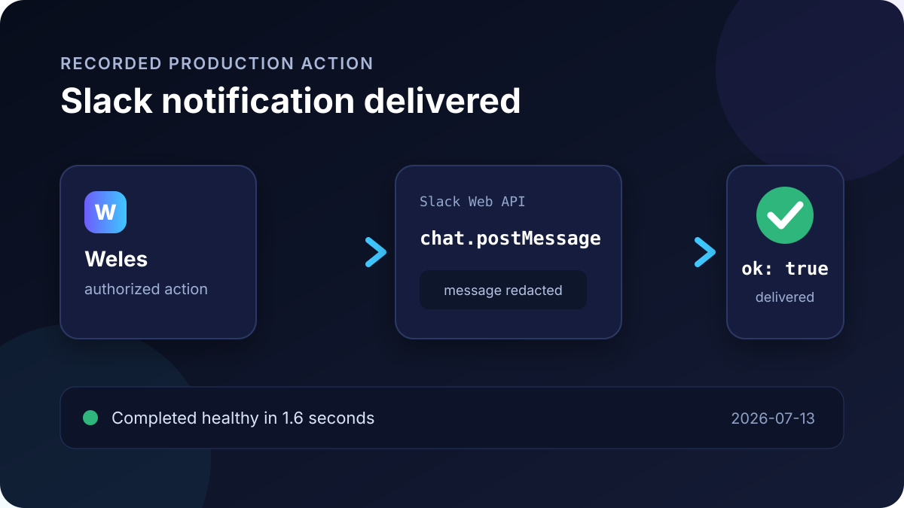
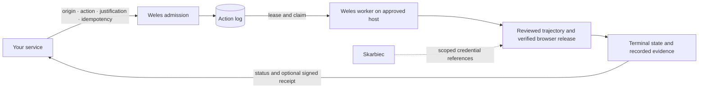

<!-- wisent-banner:start -->
<p align="center">
  
</p>
<!-- wisent-banner:end -->

<!-- wisent-readme-signals:start -->
[](https://github.com/wisent-ai/weles) [](https://github.com/wisent-ai/weles/issues) [](https://wisent.com) [](https://discord.gg/qRjpkthq54) [](https://www.linkedin.com/company/wisent-ai/) [](https://x.com/wisentai) [](https://calendly.com/lbartoszcze)
<!-- wisent-readme-signals:end -->

# Weles: Undetectable Browser for Perfect AI Agent Internet Use

Your AI agents deserve to explore the entire internet. AI can now write
software, reason for hours, and order your groceries, but it still fails or
takes ages when you ask it to open a website and log in to your account.

Weles is the solution. We turn the open internet into an API.

Weles is an undetectable browser that combines custom C++-patched Chromium and
Firefox forks with rotating fingerprints to stop your AI from running into
CAPTCHAs and bans. Every time you crawl a website, it gets mapped into a
trajectory, allowing future runs to use the cached traversal instead of having
to rediscover how the website works. When a run fails, Weles records videos
showing the points of failure to give you a clear understanding of what happened
and how it can be fixed.

Read Google 2FA without changing it: the operator CLI and Desktop reach the Stado-managed executor at the route `stado service directory connect weles-admission --consumer operator` gives, with the token of the item playing the worker's API role (`stado credentials get --role echo-weles-api --field token`); `WELES_WORKER_API_BASE` and `WELES_WORKER_TOKEN` override both. Then use `weles account-security --provider google --login-role <skarbiec-role>` and `weles account-security --run <run-id>`. The provider is named, as for `login` and `developer-certificate`; google is the one Weles reads, and a start without it is refused (`account-security needs --provider naming the identity provider whose account it reads; Weles reads google`, exit 2). This uses detached `/run` execution and retained diagnostics, not the removed database queue. The [account-security reference](https://weles.wisent.com/docs/account-security) distinguishes a provider-confirmed boolean from an unknown state; a saved seed proves neither.

Connect Gmail through the managed executor with `weles app-password --provider google --login-role <skarbiec-role> --organization <skrzynka-organization>` or `weles app-password --provider google --login-item <skarbiec-item> --organization <skrzynka-organization>`, then read its result with `weles app-password --run <run-id>`. The organization is the one Skrzynka files the mailbox under; none is assumed, and neither is the provider (`app-password needs --provider naming the identity provider that issues it; Weles issues through google`, exit 2). Admission binds the request to one exact Skarbiec login before the browser starts; an existing login does not need a role tag when its item is named directly. Skrzynka accepts the generated password only after a real IMAP login; accepting a run is not proof that the mailbox connected. See the [documentation](https://weles.wisent.com/docs/reference/security/app-password).

[Documentation](https://weles.wisent.com/docs) · [Releases](https://github.com/wisent-ai/weles/releases) · [MIT licence](LICENSE)

## See Weles work

These are public, redacted cuts from production runs. Dark boxes cover credentials
and account identifiers; the browser interaction is otherwise unchanged.

Weles opens GitHub and reaches the authenticated dashboard:


The Reddit cut ends at the enabled Log In button; the production action completed
healthy and a later health action confirmed the stored session remained usable:


Weles reaches LinkedIn's authenticated home feed; the public cut hides the profile:


Slack delivery uses `chat.postMessage`, not a browser, so there is no screen
recording. The production action received `ok: true` and completed in 1.6 seconds:



## Request access

Weles is an operated service. Access starts through
[weles.wisent.com/docs](https://weles.wisent.com/docs#get-access) or by
[booking a call](https://calendly.com/lbartoszcze). An approved deployment
provides its endpoint, organization identifier, and organization-scoped token:

```sh
export WELES_API_BASE=<deployment-endpoint>
export WISENT_ORGANIZATION_ID=<organization-uuid>
export WELES_TOKEN=<organization-scoped-token>
```

Both Weles and [weles-client](https://github.com/wisent-ai/weles-client) are public,
MIT-licensed source. You can inspect, build, and operate your own deployment.
A checkout does not include a hosted endpoint, approved trajectories, managed
credentials, evidence retention, or an SLA; these are provisioned per organization.

## Import existing Weles workflows

First setup can adopt the JSON returned by `GET /api/v1/trajectories`:

```sh
weles onboarding next
weles onboarding import <trajectory-export.json> --host <managed-worker-hostname>
```

The reusable command outside onboarding is:

```sh
weles import <trajectory-export.json> --host <managed-worker-hostname>
```

Both call `POST /api/v1/imports` using `WELES_API_BASE`, `WISENT_ORGANIZATION_ID`,
and `WELES_TOKEN`. Import validates the entire export before writing, requires
its tenant to match the authenticated organization, preserves existing rows,
and reports `imported`, `unchanged`, or `refused` for each source trajectory.
Accepted definitions are stored as drafts with their source identity, digest,
and exact target hostname. A draft is not authorization to execute.

The local HTTP service exposes authenticated `POST /imports` around that same
operation. It always requires `WELES_API_TOKEN`; the destination uses `WELES_TOKEN`.
Imports accept browser, OS, locale, headless, proxy, and session-label configuration,
but never scan or copy profiles, cookies, or credentials. A session label refers
only to state already present on the selected host.

Agents submit authorized workflows through
[`@wisent-ai/weles-client`](https://weles.wisent.com/docs/client), naming the exact
origin, action, non-secret input, credential references, justification, and
idempotency key. An accepted production action resolves to a reviewed trajectory
and ends in an explicit action-log state. When receipt issuance is configured,
the client verifies the signed outcome and evidence digest offline.

## Worker identity diagnostics

`weles worker status --json` retains `serviceIdentityFailure.operation` and
`serviceIdentityFailure.message` when the deployed identity was refused.
The same fields appear in text output and Weles Desktop's **System → Worker**.
They describe the last identity read, not a new probe; a later successful
identity read clears the failure. A running process alone is not readiness.
The public version endpoint keeps its generic refusal without private details.

The real read-only qualification is
`WELES_BIN=/absolute/path/to/weles WELES_TEST_IDENTITY_STATE=refused node tests/worker/identity-diagnostics.mjs`;
repeat with `ready` against a deployment whose identity Stado has restored.
It requires a committed checkout and the matching deployed source revision.
See [resident worker controls](https://weles.wisent.com/docs/concept-scheduler#resident-worker-controls)
for the failed operations, evidence location and verification limits.

## Enterprise

Weles Enterprise makes browser work a reviewed production capability. An
engagement defines origins and actions, versions approved trajectories, provisions
client and worker access, and binds credentials and evidence to the organization.
It can include deployment-ring policy, credential lifecycle integration, evidence
retention, and operating support. It grants no blanket permission to automate a
website; the source remains public. [Book a call](https://calendly.com/lbartoszcze).

## What your agents can do

- Browse through custom Chromium and Firefox builds with rotating fingerprints.
- Replay approved trajectories instead of rediscovering every workflow.
- Diagnose failures from the recorded operation, browser state and evidence.
- Verify terminal outcomes and, when configured, signed execution receipts.
- Use the Skarbiec credential lifecycle: acquire, adopt, rotate, reset, verify.
- Bound submissions by exact origins, actions, justification and idempotency.

## How it works


```mermaid
flowchart LR
    caller["Your service"] -->|"origin · action · justification · idempotency"| admission["Weles admission"]
    admission --> queue[("Action log")]
    queue -->|"lease and claim"| worker["Weles worker on approved host"]
    worker --> trajectory["Reviewed trajectory and verified browser release"]
    skarbiec["Skarbiec"] -. "scoped credential references" .-> trajectory
    trajectory --> evidence["Terminal state and recorded evidence"]
    evidence -->|"status and optional signed receipt"| caller
```

Credentials resolve through scoped Skarbiec grants, not plaintext requests. Draft
discovery can map a journey but cannot authorize production execution. Target
authorization remains with you: technical success does not establish permission.

### Declared engagement and observation

Interactions use `generic_saved_task` and the reviewed engagement declaration:

```json
{ "action": "generic_saved_task",
  "input": { "engagement": "twitter.like", "target_url": "https://x.com/wisent_ai/status/1" } }
```

Reading uses `generic_keeper_task` and the reviewed observation declaration:

```json
{ "action": "generic_keeper_task",
  "input": { "observation": "reddit.search", "query": "representation engineering" } }
```

`src/worker/deploy/weles-engagement-declaration.json` and
`src/worker/deploy/weles-observation-declaration.json` own the reviewed trajectories,
origins, and observation budgets. Admission refuses undeclared names, absent
trajectories, and conflicting caller-supplied origins or budgets. New sites extend
these declarations rather than adding verbs. The
[command-surface reference](https://weles.wisent.com/docs/command-surface) owns the
removed per-site verbs, replacements, counts, and recorded source revisions.

```sh
node docs/examples/resolve-action.mjs generic_saved_task twitter.like
node docs/examples/resolve-action.mjs generic_keeper_task reddit.search
```

## Wisent integrations

**Brama.** Skarbiec owns subscription identities and login material. Weles has no
separate account catalogue. Brama resolves an exact subscription through
authenticated `POST /reauth/resolve`, supplying `provider` and `subscription_id`.
It then calls `POST /reauth` with the returned `account_revision`. Weles follows
existing Skarbiec source references, performs OAuth on its Stado-selected browser
host, and stores the grant on the same subscription. It never imports provider
CLI sessions. Brama confirms repair only after its own credential refresh succeeds.

An admitted `POST /reauth` answers `application/x-ndjson`, one JSON object per
line, while the run goes: `admitted` (the resolved identity, and `coalesced`
when the request joined a run already under way), `started` (run id and host),
one `stage` per step the trajectory reports, `operator_request` when the run
waits for a person (for example a Google phone approval: the request's id,
account and instruction, also paged and shown by `weles runs list|show`),
and last `result`, the run's verdict with every stage it passed. A browser
sign-in has no clock that ends it, so this is how a caller says what it is
waiting for. A refusal before a run is admitted is a plain JSON answer with
its HTTP status. The run's record (`GET /diagnostics/<run>`, `run-result.json`)
holds the stages reached so far while it runs.

Two more runs are admitted by Brama's token and answer the same
`application/x-ndjson` stream. `POST /subscriptions/acquire` (`provider`,
`subscription_id` Brama chose, `plan_tier` such as `default_claude_max_20x`,
`reason`) buys one account of `provider` by running that provider's own
purchase trajectory, `src/trajectories/<provider>/account/acquire.mjs`: a
provider with that file is bought for, and any other is refused
`provider_unsupported` before a run starts, naming the missing file and the
providers that have one. Adding a provider is adding its trajectory (and its
declaration in Brama's `providers.json`), never another branch here. Today
`claude` has one, and it buys one Claude account: a fresh identity
on an inbound domain Weles reads, the claude.ai sign-up with the code it
mails (stages `email_code_requested`, `email_code_waiting`,
`email_code_entered`, `onboarding`, `account_created`), the login row
(`weles-login-<subscription>`, `login_method` `email_code`) and the
subscription item (`brama-sub-<subscription>`, tagged `brama:subscription`,
`brama:provider:claude-code`, `brama:id:`, `brama:account:`, `brama:login:`)
written to the vault (`account_banked`), the Max plan with the multiplier the
tier names paid with the purchase card (`plan_page`, `card_entry`,
`payment_submitted`, `payment_challenge` with an `operator_request` of kind
`payment_approval` when the card issuer holds the payment, `plan_paid`), and
the account signed in for Brama in the same browser (`oauth_consent`,
`token_exchange`, `credential_persist`). The `result` names `account`,
`subscription_item`, `login_item` and `paid` whenever they exist, also when a
later step failed, so a paid account is never unnamed. Failures are named:
`plan_tier_unknown`, `purchase_card_missing`, `purchase_card_incomplete`,
`phone_verification_required`, `onboarding_page_unrecognized`,
`plan_choice_missing`, `plan_proceed_missing`, `card_entry_failed`,
`payment_submit_missing`, `payment_declined`, `email_code_unreadable`, each
with the page and its DOM snapshot where a page was involved.

`POST /reauth/authorize` (`provider`, `subscription_id`, `authorize_url`)
completes one OAuth authorization a coding-agent harness started, as the
subscription's account: only the provider's own authorize page is driven, and
only when its `redirect_uri` is the harness's `localhost` listener
(`authorize_url_refused` otherwise). The browser catches that redirect
(`oauth_redirect`) and `result.redirect_url` carries it back, so the harness
(`omp login anthropic`, which reads "the final redirect URL" on stdin) mints
and refreshes its own grant with the verifier only it holds. A login row may
sign in with `google_sso`, `email_password` or `email_code`.
`POST /reauth/accounts` (`provider`) answers, without starting anything,
which accounts the vault's subscriptions of that provider resolve to
(`accounts`: `subscription_id`, `account`, `login_item`) and every
subscription that does not resolve, with its refusal (`errors`). A machine
that holds no vault of its own (where `brama subscription hand-over` signs
the pool's accounts into omp) reads the pool here.

A run's record shows the last stage it reached, not that it has stood on one
page for an hour, and a sign-in is coalesced per account: every later sign-in
of that account joins the run already under way. `weles runs list` (`GET
/runs`) lists every run the worker has a live child for, with when it last
wrote anything and, when it waits for a person, what it asked for and whether
the person was paged (`operator_request`); `weles runs show <run>` (`GET
/runs/:run_id`) prints the last lines it wrote, every page, answer and note of
the request it waits on, or its record once it finished. `weles runs answer
<run> --ready | --approved | --not-received [--detail <text>]` (`POST
/runs/:run_id/answer`) tells a waiting run what the person did; a run that
waits on nobody is refused (409 `run_not_waiting`) with the stage it stands
at. `weles runs cancel <run> --detail <who and why>` (`POST
/runs/:run_id/cancel`) kills the run's process group and records it as
cancelled with that detail; a sign-in ends with failure `run_cancelled` at the
stage it reached, and the next sign-in of that account starts a new run
instead of joining or replaying it. A run that already finished is refused
(409) with when; a run recorded as `running` that no live child answers for
was left by a server that stopped. Desktop Running has the same list, what a
run waits for, the last output, Ready, I approved it and No prompt arrived buttons, and a
Cancel button. A closing
session prints `[wsession] fingerprint probe: <section>` before each part of
its close-time fingerprint probe that waits on the browser, so a probe that
never answers is named by the section it stands in. A Claude sign-in whose
claude.ai page shows "Continue with Google" disabled reports stage
`gis_gate_pending` and waits for the page to enable it or move on, instead
of failing as an unknown page. When claude.ai puts a captcha challenge
(hCaptcha, reCAPTCHA, Arkose or Turnstile) over its page after Google signed
the account in, Weles answers it with its captcha solver (stage
`claude_captcha_answer`) through the solving services whose keys Skarbiec
holds, waits for the challenge to go, and continues the sign-in. It ends the
sign-in only with a refusal that names the challenge: `provider_captcha_unreadable`
(a challenge frame Weles' detection does not read, with its DOM snapshot),
`provider_captcha_no_solver` (Skarbiec holds no solving-service key) or
`provider_captcha_unsolved` (the challenge kind, its site key, the services
tried and the DOM snapshot).

Results identify the subscription, login item, actual failed operation, HTTP status
and run id. `account_revision` describes Skarbiec data; `source_revision` identifies
the Weles software. Missing source references, cycles, conflicting login material
and changed identity are refused before credential persistence.
Google sign-in selects a visible password choice before opening alternative
methods. Hidden refusal templates do not count as provider refusals. A visible
refusal or unavailable password challenge reports its observed page and stage;
the same run never resubmits the selected challenge. Session closure also stops
its measurement timers, so retained results do not wait for the worker timeout.
An authenticator code must leave Google's challenge before provider handoff.
Without a stored seed, Weles uses an offered phone approval, and sends Google's
prompt only when the operator says he is ready: the run asks him first, and
chooses Google's phone method on `weles runs answer <run> --ready` (Weles
Desktop > Running > Ready, send it), then asks him to approve it with the
number to match. A sign-in nobody is asked about (no run waits on a person)
sends no prompt and stops with `google_push_approval_required`. The actual
outcome is recorded on the request the run waits on.

A request is paged through `stado alerts send`, which reaches the operator by
the channels he chose for the fleet (`stado alerts preferences set --channel
<name> ...`; with no choice the page is refused and the request records that
nobody was told). It names the Weles
run that waits on it (`run_ids`; a second run that needs the same person for
the same account joins the request instead of paging again), and waits until
Google's page moves (approving on the phone needs nothing else) or the
operator answers the run. Google's device prompt announces itself in live
regions ("2-Step Verification … wants to make sure it's really you"); what
the page already announced when the wait began is the prompt. A new alert
shown beside Google's own "Resend it" is the prompt expiring before he
approved it: the run does not fail, it records the expiry with its time on the
request, pages him again with `weles runs answer <run> --not-received` as the
way to get a new prompt, and keeps waiting. Any other new alert is read as
Google's refusal. `weles runs answer
<run> --not-received` makes the run press Google's "Resend it", or end with
`google_prompt_not_received` when Google offers none; `--approved` while
Google still shows the prompt records what the page shows; ending the wait is
`weles runs cancel`. `weles runs show` lists every answer, every page and
what the run did about it. A Google page under `accounts.google.com/info/` (`sessionexpired`
among them) ends the sign-in itself: the request closes as not approved and
the run ends with `google_sign_in_ended_during_approval`, naming that page and
when the approval was asked. Every worker run, a sign-in or any other
trajectory, closes its browser without the close-time fingerprint probe
(`WELES_FINGERPRINT=0`): its verdict does not wait on a detection probe, and
the probe would send the signed-in browser to a third-party TLS echo after the
provider's pages.

`google_2fa_material_missing` remains a structured refusal when no usable
authenticator material or offered phone method can answer the challenge.
Enrolment refuses to replace an existing authenticator and writes a seed only
after observing completed Google setup. Results preserve the observed
`second_factor` method; a successful grant without that evidence stays unknown.

Both services acquire `brama-weles-reauth/token` from Skarbiec with their own
workload identities. Weles accepts that bearer only on the reauthentication routes.
No shared environment file or copied token connects them. They resolve the canonical
Skarbiec endpoint through Stado and use its attested active executable for local
capability brokering, never an alternate vault. Brama resolves `weles-admission`
as consumer `brama` with `credential-lifecycle`; `BRAMA_WELES_URL` remains an
explicit endpoint override.

Reauthentication evidence survives releases under `$HOME/.stado/var/weles/recordings`;
run verdicts live under `$HOME/.stado/weles-detached-runs`. Authenticated
`GET /diagnostics/<run_id>` includes `run-result.json` for accepted runs, including
pre-browser failures, and lists retained DOM, video and trajectory logs when present.
A completed diagnostic journey is not proof that the website operation succeeded;
read the recorded result and final state.

**Skarbiec.** Exact `consumer|item|field` scopes supply approved credentials. Literal `type_text`, `fill` and `set_control` inspect the actual field and refuse credential edits; selectors do not bypass this check.
Generic tasks seed the executor's action history with completed navigation and prefills, retain those receipts as `initialization_history`, and remove consumed capabilities from available inputs. Prefilled runs never reuse or save a flow cache. Deferred, absent fields keep their unspent capabilities; an invented account is never a substitute.

**Stado.** Stado places and operates the approved host and verifies browser release
coordinates. Synchronous reauthentication uses the same trajectory as queued work.
The Weles package includes its recording executable rather than relying on an
evictable host cache. `weles doctor` reports the expected recording component and
whether it is present; successful browser execution proves that it actually works.

**Jeden.** macOS workers carry the signed `jeden` and `jeden-sandbox-helper`
together under `native/jeden/bin/`; Linux worker archives carry their native CLI.
Both publishers use `release/native/runtime.mjs` and the URI/SHA-256 pins in
`.wisent-release.json`. Missing, non-executable or incorrectly hashed inputs are
refused. No host installation or inherited `WELES_JEDEN_BIN` replaces this runtime.

Native tasks read their own screenshot or frame directory through Jeden's `--cwd`, without write or command grants. An unanswered page question stops live execution and cached replay with its cause. Successful caches use `weles.successful-flow.v1`; earlier caches are rediscovered because they could contain failed reads. `generic_keeper_task` always observes the current page instead of replaying a saved result.

Startup runs each required binary with `--version` before acquiring credentials
or starting the API. A refusal names the binary, operation and observed error,
including exit status and signal. Stado's release launcher derives missing or
non-executable cached files again from its payload and refuses an incomplete
payload. Page reading and diagnosis use these binaries; model-only calls stay
on Brama.
Runtime files live under `$HOME/.stado/var/weles/runtime/<payload-sha256>`, outside
Stado's immutable installation.

### Mobile egress managed by Stado

Weles may use a phone's mobile connection as its browser exit. Stado owns the
long-running proxy; Weles owns proxy selection, target policy and browser execution.
USB tethering is preferable to Wi-Fi tethering for stability. Use the approved
host's real interface and installed Stado executable:

```sh
networksetup -listallhardwareports
stado egress mobile serve --interface en7 --port 8781 --max-header-bytes "$HEADER_BYTES"
weles open https://example.com --proxy http://127.0.0.1:8781
stado service ensure weles-mobile-egress \
  --host <weles-host> --from /Users/<service-account>/.stado/bin/stado \
  --arg egress --arg mobile --arg serve --arg=--interface --arg en7 \
  --arg=--port --arg 8781 --arg=--max-header-bytes --arg "$HEADER_BYTES" \
  --reason "Weles mobile egress"
stado service status weles-mobile-egress
```
`HEADER_BYTES` is the deployment's positive whole-byte request-header budget.
Stado refuses an undeclared budget before listening. The bound includes the
terminating blank line but not forwarded bodies or tunnel payloads. See
[Stado configuration](https://stado.wisent.com/docs/configuration/#mobile-egress-request-boundary)
for refusals, service logs and the real qualification command.


`en7` is an example, not a default. The proxy binds upstream connections to that
interface and refuses non-loopback listeners or an unusable IPv4 interface. Browser
and proxy run on the same host. Trajectories pass `proxy: 'http://127.0.0.1:8781'`
to `WSession.start`; the CLI uses `--proxy`. Normal Stado commands own later
status, logs and service lifecycle.

Mobile exits may match a site's expected identity but can be slower, unstable or
behind carrier NAT. Residential and datacenter exits fit different workloads;
the type alone proves no quality. Check IP, ASN, geography, proxy classification,
DNS/WebRTC behavior, latency and target response. Stado's real-device egress tests
require a trusted phone and observed mobile IP classification. Disconnected hardware
or an unclassified exit is not a passing result.

### Passwords of accounts Weles registers

Every registration (the shared identity generator, Pangram, SadCaptcha, 2Captcha)
takes its password from one generator: one character of each class sign-up forms
check (upper, lower, digit, special), the rest from all of them, shuffled, at the
length the vault's policy states. Set it once with
`skarbiec policy set min_generated_length <length>`; with none set, a registration
is refused naming that command, and a length shorter than the four classes is
refused too. `node tests/identity/password.mjs` checks this against an isolated
vault made with `skarbiec init`.

## Benchmark against rivals

Stado's product catalog names Weles's rivals (Browser Use, Skyvern, Stagehand)
and the suite that measures them, `web-agent-v1`. Probierz runs it:
`apps/weles/probierz.yaml` in Probierz declares the suite and one contender per
product, and `probierz benchmark` records each run, its standing and the cases
Weles lost.

- `benchmark/web-agent-v1.json` holds five cases (static extraction, link
  navigation, a form submission, client-side rendering, a 100-row table) with
  their assertions; contenders never see the expected values.
- `benchmark/fixture.mjs --host <address> --port <port>` serves the
  deterministic site the cases open. The suite's `variables` name
  `WELES_BENCHMARK_FIXTURE_ORIGIN` for its `${FIXTURE_ORIGIN}` placeholder, and
  Probierz fills it in before a contender reads the task.
- `benchmark/contenders/weles.mjs` sends a case to the authenticated
  `/weles-builder` endpoint (`WELES_API_BASE`, `WELES_TOKEN`).
  `benchmark/contenders/stagehand.mjs` runs Stagehand's DOM agent with model
  calls through Brama (`BRAMA_BASE_URL`, `BRAMA_API_KEY`, `BRAMA_MODEL`) and the
  packages installed under `STAGEHAND_MODULES`.
- Rival drivers are not written here by hand. `probierz benchmark author`
  drafts each one from the catalog's record of the rival, places it under
  `benchmark/rivals/<id>/` (the one place Wisent's zero-Python rule does not
  reach, because some rivals ship only a Python SDK), declares it in the
  manifest and keeps it only once a recorded run shows it speaks the contract.

Run the fixture and the contenders on the Stado-selected benchmark host, never
on an operator workstation, then:

```sh
probierz benchmark rivals weles
probierz benchmark author weles --contender browser-use --suite web-agent-v1
probierz benchmark author weles --contender skyvern --suite web-agent-v1
probierz benchmark run weles --suite web-agent-v1
probierz benchmark standing weles --suite web-agent-v1
probierz benchmark roadmap weles --suite web-agent-v1
```

`rivals` refuses while a rival the catalog names has no contender, and names
the `author` command that drafts it.

## Compatibility and status

- Client source defines the `0.1.0` minimum public contract; an endpoint and immutable
  package release are separate provisions, not promises from a checkout.
- Task, cancellation, status and receipt schemas expose versioned `current` aliases.
- Workers ship as immutable releases promoted through the declared deployment rings.
- Chromium and Firefox launch only with the Stado-selected release coordinate and checksum.

## Formatting

The JavaScript and TypeScript sources (`benchmark`, `docs`, `release`,
`scripts`, `src`, `tests`) are formatted by Biome in its default style; the
release is pinned in `release/fmt.sh` and run through `npx`. The release
manifest declares it as the `fmt` quality gate, which `stado release changes
submit` runs before a commit is handed to the batch build:

```
bash release/fmt.sh --check   # lists what Biome would change, exits nonzero
stado quality format --root .  # writes Biome's formatting
```

## Community and support

Use [Discord](https://discord.gg/qRjpkthq54) for discussion and the repository issue
tracker for operational defects. Include the action-log id, worker identity and
release coordinate, not credentials or private recordings.

## Security and licence

Report vulnerabilities through a
[private GitHub Security Advisory](https://github.com/wisent-ai/weles/security/advisories/new).
Never put credentials, private trajectories, recordings or target details in public issues.
[MIT](LICENSE). Source availability grants neither operated-service access nor target authorization.
